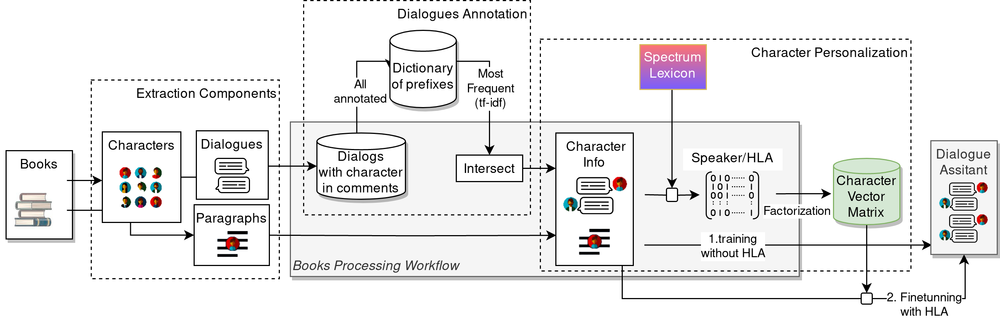

# Book Processing Framework

    

This repository represents a core of the book processing aimed at dialogue extraction [algorithm]
for forming the related **datasets** of conversations between characters.
The content of dataset yields of dialogues, with utterances that **automatically annotated with speakers** [quotation annotations].

**Personalities**: We also provide API for collection information on characters and composing their personalities in a vector form.
We adopt **spectrum** model for vectorizing characters representation [link to spectrums].
By provide factorization model [aloha github] over vectorized representation of characters [t-sne].

**Research Directions**. 
The directions this project was aimed at the following research directions:
* `e_pairs` -- extraction of dialogue pairs including speaker assignation;
* `e_se_subin`  -- extraction of the speakers for utterances;
* `e_rag` -- extraction of utterances and contexts as well as forming character knowledge based for RAG and augmenting transformers.

For each direction we provide a pipeline (sequence of the separately ordered scripts) aimed at resource construction and evaluation.

**Limitation:** we consider books from Project Gutenberg [link-to-project]. 
We utilize CEB framework [link-to-project] with pre-annotated and grouped speakers.
We also utilize PG19 as a source of metadata from books.