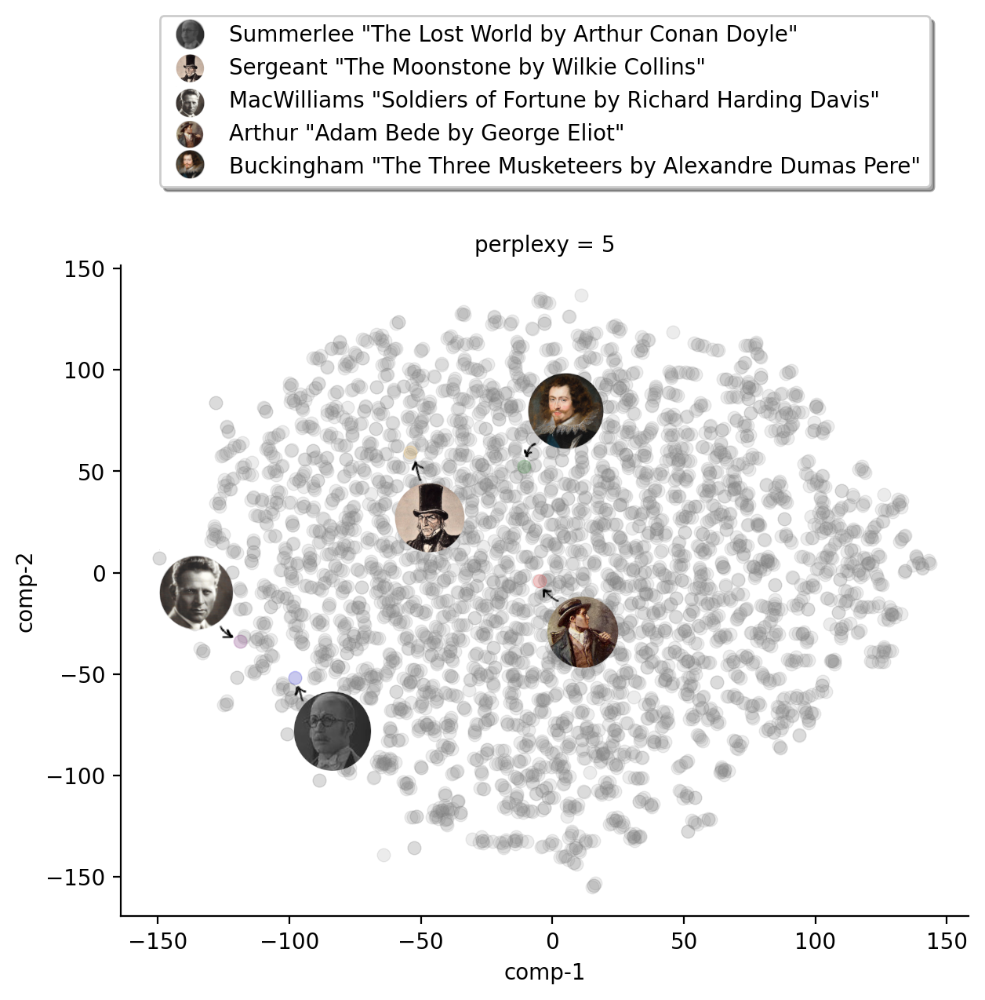

# Book Processing Framework

## Contents
* [Workflow](#workflow)
* [Research directions](#research-directions)
* [Datasets](#datasets)
* [Dependencies](#dependencies)

## Workflow

This repository represents a core of the book processing aimed 
at [**automatic dialogue extraction**](https://arxiv.org/abs/2004.12752)
and allows forming **datasets** of conversations between characters.
The content of dataset yields of dialogues, with utterances that 
annotated with speakers 
([**quotation annotation**](https://github.com/dbamman/litbank?tab=readme-ov-file#quotation-annotations) problem,
[[paper]](https://arxiv.org/pdf/2004.13980.pdf)).

    

### Personalities
We also provide API for collection information on characters and composing their personalities in a vector form.
We adopt **spectrum** model for 
vectorizing characters representation, using 
[spectrums as features](https://github.com/tacookson/data/tree/master/fictional-character-personalities).
By provide [personalities factorization model](https://github.com/newpro/aloha-chatbot) 
over vectorized representation of characters:

    

## Research Directions
The directions this project was aimed at the following research directions:
* `e_pairs` -- extraction of dialogue pairs including speaker assignation;
* `e_se_subin`  -- extraction of the speakers for utterances, which is discovered by [Subin Jung](https://github.com/SubinJung-CS);
* `e_rag` -- extraction of utterances and contexts as well as forming character knowledge based for RAG and augmenting Large Languge Models (LLM).

For each direction we provide a pipeline (sequence of the separately ordered scripts) aimed at resource construction and evaluation.

## Datasets

The dataset based on 17K books with filter 400 most representative speakers become dubbed as
**LDC-400**.
There are multiple version of them depending on the downstream tasks, 
as well as framework-dependent parameters that effect on data formatting.

For `e_pairs` and `e_se_subin` research directions, 
we utilize 
[ParlAI](https://github.com/facebookresearch/ParlAI) 
framework for conducting experiments.
In order to embed extracted data, we utilize the related data formatter. 

> **NOTE:** [Please use `nicolay-r/parlai_bookchar_tark` repository](https://github.com/nicolay-r/parlai_bookchar_task) on embedding task into ParlAI. 
> All the resources below are automatically downloaded once the task is embedded into ParlAI framework. 

Below are the links for the fine-cleaned dataset of dialogue pairs between **400 most-frequently appeared characters**:

## `LDC-400` [Response Prediction]

Link for **ParlAI** agents: [[parlai-agents]](https://github.com/nicolay-r/parlai_bookchar_task/blob/master/build.py)

| Collection-type | Format | train                                                                                                                                             | valid                                                                                                                                             |
|-----------------|--------|---------------------------------------------------------------------------------------------------------------------------------------------------|---------------------------------------------------------------------------------------------------------------------------------------------------|
| **NO-HLA**      | ParlAI | [Train w/o HLA](https://www.dropbox.com/scl/fi/cmflno09yyvw70mpf4fli/dataset_parlai_train_original.txt.zip?rlkey=477zsekm5j0a4dpco0w9479uo&dl=1)  | [Valid w/o HLA](https://www.dropbox.com/scl/fi/508zfhxewvweqtn4k7hfg/dataset_parlai_valid_original.txt.zip?rlkey=3a0syeturb84lxtmizq1o5bsx&dl=1)  |
| **HLA**-spectrum| ParlAI | [Train with HLA](https://www.dropbox.com/scl/fi/ax62dvkik12alxj604ute/dataset_parlai_train_spectrum.txt.zip?rlkey=xuvmvze6fnak413gst54qd4qz&dl=1) | [Valid with HLA](https://www.dropbox.com/scl/fi/lr96to0rzc6wpo84isscb/dataset_parlai_valid_spectrum.txt.zip?rlkey=5wrgtrtuulf3baxr724bcycdu&dl=1) |

## `LDC-400` [Speaker Recognition]

Link for **ParlAI** agents: [[parlai-agents]](https://github.com/nicolay-r/parlai_bookchar_task/blob/speaker-recognition-task/build.py)

| Collection-type  | Format | train                                                                                                                                                      | valid                                                                                                                                                      |
|------------------|--------|------------------------------------------------------------------------------------------------------------------------------------------------------------|------------------------------------------------------------------------------------------------------------------------------------------------------------|
| **HLA**-spectrum | ParlAI | [Train with HLA](https://www.dropbox.com/scl/fi/r241a1ma2douus965h7lf/dataset_parlai_train_hla.txt.zip?rlkey=dwcnm0yxn2boujomd53nx0595&dl=1) |[Valid with HLA](https://www.dropbox.com/scl/fi/arzub1tmegklkf93dthpr/dataset_parlai_valid_hla.txt.zip?rlkey=lpa8vcs48f3bxegk3gtw22h2i&dl=1)  |

## Experiments

## Dependencies 

We consider books from [Project Gutenberg](https://www.gutenberg.org/).

We utilize:
* [CEB-framework](https://github.com/naoya-i/charembench) -- pre-annotated and grouped speakers from **Project Gutenberg**. [[paper]]()
* [gutenberg-dialog](https://github.com/ricsinaruto/gutenberg-dialog) -- automatic dialogue annotation algorithm [[paper]]()
