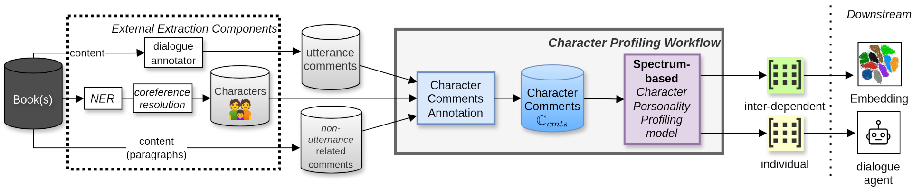
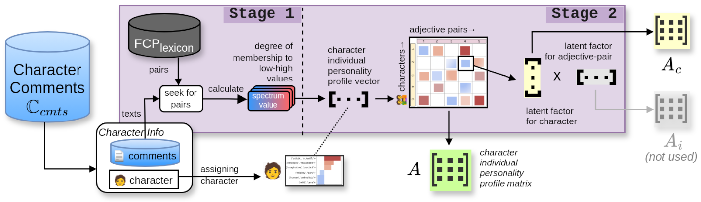
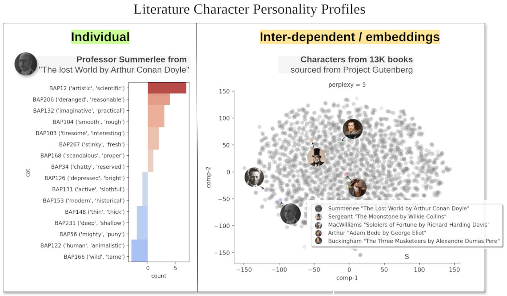

# Book-based Fictional Character Profiling Workflow • [](https://x.com/nicolayr_/status/1801009815784677862)

[](https://colab.research.google.com/github/nicolay-r/deep-book-processing/blob/master/parlai_gutenberg_experiments.ipynb)
[](https://x.com/nicolayr_/status/1801009815784677862)

This repository represents source code 
for the *literature 📚 character personality formation* **workflow** which is 
🔥 **solely relies on book content only** 🔥, 
described in paper 
[Personality Profiling for Literary Character
Dialogue Agents with Human Level Attributes (**pre-print**) ](https://www.dropbox.com/scl/fi/0c2axh97hadolwphgu7it/rusnachenko2024personality.pdf?rlkey=g2yyzv01th2rjt4o1oky0q8zc&st=omssztha&dl=1)
that has been accepted for *Long Paper* track at
[LOD-2024](https://lod2024.icas.events/).

## Contents
* [**Workflow**](#workflow)
    * [Personality Profiling Model](#personality-profiling-model)
    * [Applications](#applications)
* [**Datasets**](#datasets)
* [**Experiments**](#experiments)
* [Organizations](#experiments)
* [Dependencies](#dependencies)

## Workflow

This repository represents a source code for literature novel book [processing workflow implementation](e_pairs).

> **Task**: Studies propose the novel *Character Comments Annotation* problem, which refers to [**quotation annotation**](https://github.com/dbamman/litbank?tab=readme-ov-file#quotation-annotations)
[[paper]](https://arxiv.org/pdf/2004.13980.pdf).

<p align="center">
    
</p>

This workflow relies on **external text processing components**:
(1) NER,
(2) [**automatic dialogue annotation**](https://arxiv.org/abs/2004.12752).
See [dependencies](#dependencies) section for greater detail.

The formation of [**datasets**](#datasets) of character conversations
represent a byproduct of the related data flow.
The content of dataset yields of dialogues, with utterances that
annotated with speakers.

### Personality Profiling Model
We adopt adjective-pair lexicon as a source for the 
**[spectrum-based](https://github.com/tacookson/data/tree/master/fictional-character-personalities) character profiling model**.
We provide API for collection information on characters and composing their personalities in a form of **output matrices**:

<p align="center">
    
</p>

Each row of the matrix represent **character** and columns related to their **personality traits**.
There are two type of output personalities (see figure below): (left) **individual** and (right) **inter-dependent / embeddings** 
based on [personalities factorization model](https://github.com/newpro/aloha-chatbot).


<p align="center">
    
</p>

## Applications 

The directions this project was aimed at the following research directions:
* `e_pairs` -- response generation and response prediction for the given **dialogue pairs** aka CONV-turns;
* `e_se` **[legacy]**  -- extraction of the speakers for utterances in [Subin Jung](https://github.com/SubinJung-CS) thesis work;
* `e_rag` **[legacy]** -- extraction of utterances and contexts as well as forming character knowledge based for RAG and augmenting Large Languge Models (LLM).

For each direction we provide a pipeline (sequence of the separately ordered scripts) aimed at resource construction and evaluation.

# Datasets

* **[LDC](#ldc)**
  1. **[LDC-400-RP](#ldc-400-rp)**
  2. **[LDC-400-SR](#ldc-400-sr)**

## `LDC`

The common version of the resource dubbed as Literature Dialogue Collection (`LDC`).

It consists of dialogues extracted from 17K books of the [Project Gutenberg](https://www.gutenberg.org/) platform.
This resource could be automatically constructed using the following steps:
1. [Downloading](download_data.py) all the necessary books 📚 and resources (Downloading takes: **~3.5 hours** ☕)
2. Executing the scripts from `e_pairs` directory.

We fine-cleaned dataset of dialogue pairs between `400` **most-frequently** appeared characters which results in `LDC-400` datasets.

## `LDC-400-RP`

This dataset if for the **Response Prediction** problem.

We utilize
[ParlAI](https://github.com/facebookresearch/ParlAI)
framework for conducting experiments.
In order to embed extracted data, we utilize the related data formatter. 

Link for **ParlAI** agents / task: [[parlai-agents]](https://github.com/nicolay-r/parlai_bookchar_task/blob/master/build.py)

**Candidates count:** 20

| Collection-type | Format | train                                                                                                                                             | valid                                                                                                                                             | test                                                                                                                                                                                                                                                                                                                                                                                                                                                                                                                                                                                                                                                                   |
|-----------------|--------|---------------------------------------------------------------------------------------------------------------------------------------------------|---------------------------------------------------------------------------------------------------------------------------------------------------|------------------------------------------------------------------------------------------------------------------------------------------------------------------------------------------------------------------------------------------------------------------------------------------------------------------------------------------------------------------------------------------------------------------------------------------------------------------------------------------------------------------------------------------------------------------------------------------------------------------------------------------------------------------------|
| **NO-HLA**      | ParlAI | [Train w/o HLA](https://www.dropbox.com/scl/fi/cmflno09yyvw70mpf4fli/dataset_parlai_train_original.txt.zip?rlkey=477zsekm5j0a4dpco0w9479uo&dl=1)  | [Valid w/o HLA](https://www.dropbox.com/scl/fi/508zfhxewvweqtn4k7hfg/dataset_parlai_valid_original.txt.zip?rlkey=3a0syeturb84lxtmizq1o5bsx&dl=1)  | Not Applicable                                                                                                                                                                                                                                                                                                                                                                                                                                                                                                                                                                                                                                                         |
| **HLA**-spectrum| ParlAI | [Train with HLA](https://www.dropbox.com/scl/fi/ax62dvkik12alxj604ute/dataset_parlai_train_spectrum.txt.zip?rlkey=xuvmvze6fnak413gst54qd4qz&dl=1) | [Valid with HLA](https://www.dropbox.com/scl/fi/lr96to0rzc6wpo84isscb/dataset_parlai_valid_spectrum.txt.zip?rlkey=5wrgtrtuulf3baxr724bcycdu&dl=1) | Five speakers: [[1]](https://www.dropbox.com/scl/fi/59pcnfytpckv34dbvm2x0/139_1.parlai_dataset.txt.zip?rlkey=c9fwoxbyta9f05f79l4bkym8o&dl=1) [[2]](https://www.dropbox.com/scl/fi/q07aph6we2x2wkwid65en/155_21.parlai_dataset.txt.zip?rlkey=qzs9cj4uk01vir2k46ztr7934&dl=1) [[3]](https://www.dropbox.com/scl/fi/214biikj5wianib7517ou/403_3.parlai_dataset.txt.zip?rlkey=qo6f7kr2mw6gafix467vl2cxe&dl=1) [[4]](https://www.dropbox.com/scl/fi/rhfukpgaxvpevqw4jnhmg/507_3.parlai_dataset.txt.zip?rlkey=6qcxui6a7mtc5b8xhp4zsoy7n&dl=1) [[5]](https://www.dropbox.com/scl/fi/07mp58p0fnw531tptdit4/1257_9.parlai_dataset.txt.zip?rlkey=1wesdzd1hqj668ztirh5yqidc&dl=1) |
| Human Evaluation| Text | -- | -- | Five speakers: [[1]](resources/human_eval/139_1.txt.zip) [[2]](resources/human_eval/155_21.txt.zip) [[3]](resources/human_eval/403_3.txt.zip) [[4]](resources/human_eval/507_3.txt.zip) [[5]](resources/human_eval/1257_9.txt.zip) |

> **NOTE:** [Please use `nicolay-r/parlai_bookchar_task` repository](https://github.com/nicolay-r/parlai_bookchar_task) on embedding task into ParlAI.
> All the resources below are automatically downloaded once the task is embedded into ParlAI framework. 

## `LDC-400-SR`

This dataset is for **Speaker Recognition** problem.

We utilize
[ParlAI](https://github.com/facebookresearch/ParlAI)
framework for conducting experiments.
In order to embed extracted data, we utilize the related data formatter. 

Link for **ParlAI** agents / task: [[parlai-agents]](https://github.com/nicolay-r/parlai_bookchar_task/blob/speaker-recognition-task/build.py)

**Candidates count:** 20

| Collection-type  | Format | train                                                                                                                                                      | valid                                                                                                                                                      | test                                                                                                                                                                                                                                                                                                                                                                                                                                                                                                                                                                                                                                                                    |
|------------------|--------|------------------------------------------------------------------------------------------------------------------------------------------------------------|------------------------------------------------------------------------------------------------------------------------------------------------------------|-------------------------------------------------------------------------------------------------------------------------------------------------------------------------------------------------------------------------------------------------------------------------------------------------------------------------------------------------------------------------------------------------------------------------------------------------------------------------------------------------------------------------------------------------------------------------------------------------------------------------------------------------------------------------|
| **HLA**-spectrum | ParlAI | [Train with HLA](https://www.dropbox.com/scl/fi/r241a1ma2douus965h7lf/dataset_parlai_train_hla.txt.zip?rlkey=dwcnm0yxn2boujomd53nx0595&dl=1) |[Valid with HLA](https://www.dropbox.com/scl/fi/arzub1tmegklkf93dthpr/dataset_parlai_valid_hla.txt.zip?rlkey=lpa8vcs48f3bxegk3gtw22h2i&dl=1)  | Five speakers: [[1]](https://www.dropbox.com/scl/fi/5gqbauw3bp3mnvkfkvh21/153_2.parlai_dataset.txt.zip?rlkey=a0rzgilfdq4vao7oy4cibt2ew&dl=1) [[2]](https://www.dropbox.com/scl/fi/0z1fwabtqv2fjsxdhjel1/403_3.parlai_dataset.txt.zip?rlkey=jsnymkkxs10b2j8r7ewfxpw6k&dl=1) [[3]](https://www.dropbox.com/scl/fi/w2y28hhpkral36uk5rby1/1257_7.parlai_dataset.txt.zip?rlkey=wm7mue848kzr4yubd7m9idpew&dl=1) [[4]](https://www.dropbox.com/scl/fi/8a56x1oviz15w4ppi1v9q/1257_9.parlai_dataset.txt.zip?rlkey=ysnibgk3j68nedtlp3g6oc2ew&dl=1) [[5]](https://www.dropbox.com/scl/fi/vpeq6r29zoja352eabe99/1258_8.parlai_dataset.txt.zip?rlkey=f8y9261af2bu1pameffw14bzc&dl=1) |

> **NOTE:** [Please use `nicolay-r/parlai_bookchar_task` repository](https://github.com/nicolay-r/parlai_bookchar_task) on embedding task into ParlAI.
> All the resources below are automatically downloaded once the task is embedded into ParlAI framework.

## Experiments
[](https://colab.research.google.com/github/nicolay-r/deep-book-processing/blob/master/parlai_gutenberg_experiments.ipynb)


## Dependencies 

1. **NER**:
    * [CEB-framework](https://github.com/naoya-i/charembench) -- pre-annotated and grouped speakers from **Project Gutenberg**. [[paper]]()
2. **Dialogue utterances extraction** from literature novel books:
    * [gutenberg-dialog](https://github.com/ricsinaruto/gutenberg-dialog) -- automatic dialogue annotation algorithm [[paper]]()
    
## Organizations

This work has been accomplished as a part of my Research Fellow position at Newcastle University.
<p align="left">
    
</p>


## References

You can cite this work as follows:

```bibtex
@proceedings{rusnachenko2024personality,
  title     = {Personality Profiling for Literary Character Dialogue Agents with Human Level Attributes}
  authors   = {Rusnachenko, Nicolay and Liang, Huizhi}
  booktitle = {Proceedings of the 10th International Conference on Machine Learning, Optimization, and Data Science (LOD)},
  year      = {2024},
  month     = sep,
  days      = {22--25},
  address   = {Castiglione della Pescaia (Grosseto), Tuscany, Italy},
  publisher = {Springer}
}
```
